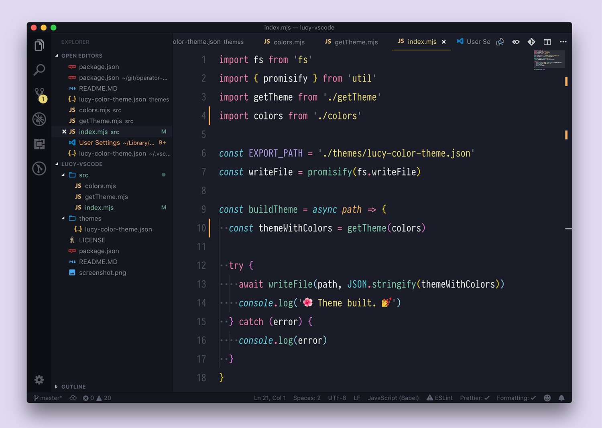

# Overview

A reupload of the [lucy-vscode-theme](https://github.com/jul-sh/lucy-vscode-theme) with the following themes:

- `lucy` & `lucy-evening`: The original theme with small fixes that use the original color palette.
- `oh-lucy`: Close to the original, but with opinionated changes.

---

Customizable. Change the colors in `color.mjs` & run `npm run build` to build
the theme.

To apply your customized theme copy this entire folder to
`~/.vscode/extensions`.

<!-- # Publish Commands
# VSC: https://hashnode.com/post/create-and-publish-a-vs-code-theme-ckz2r72o00n44mjs1d4bkc0fb
npx vsce login Hermitter
npx vsce package
npx vsce publish

# Open VSX
npx ovsx publish -p <token>
-->
